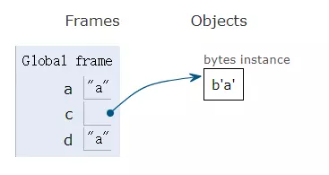
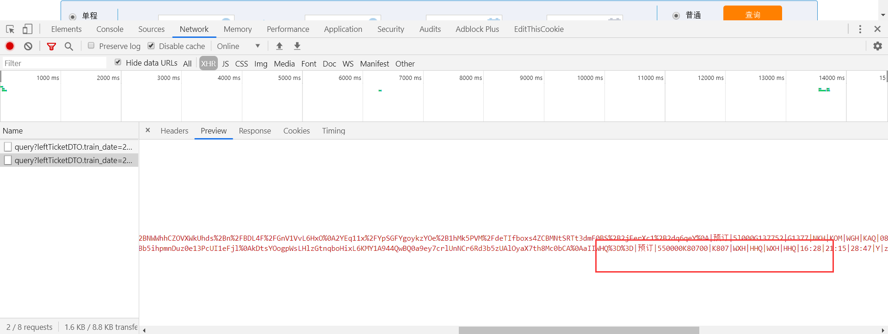

# 字符串和编码

### 字符串(Stirng)

单引号、双引号、三引号均可包裹字符串

```python
a = '单引号字符串'
b = "双引号字符串"
c = '''
三引号字符串
可换行
'''
d = """
三引号字符串
可换行
"""
```

#### 常见操作

##### 切片

与数组中的切片含义一致

```python
a = 'Hello World!'
print(a[:-1]) # Hello World
```

##### 求长度

```python
b = "abc"
print(b.count()) # 3
```

##### 字符编码和解码

编码将字符串转换为字节对象，解码将字节对象转换为字符串

```python
a = "a"
b = a.encode("utf-8")
c = b.decode("utf-8")
```



##### 检查是否包含某个字符串

```python
a = "Test111"
print(a.find('111')) # 4，找不到就 -1
print(a.index('111')) # 4，找不到就抛出异常结束程序运行
```

##### join方法

一般用于拼接字符串，比如希望将数组数据按照 `,` 分隔

>  注意：迭代对象的每一个元素都需要是字符串

```python
print(','.join(['1', '2', '3'])) # 1,2,3
```

##### 格式化输出

格式由 `%` 以及格式字符串组成，用于将数据按照指定格式输出

| 格式化输出标记 | 含义                          |
| -------------- | ----------------------------- |
| %%             | 输出百分号                    |
| %c             | ASCII码                       |
| **%s**         | 字符串                        |
| **%d**         | 有符号整数（十进制）          |
| %ld            | 长整形                        |
| %u             | 无符号整数（十进制）          |
| %o             | 无符号整数（八进制）          |
| %x             | 无符号整数（十六进制）        |
| %X             | 无符号整数（十六进制大写）    |
| %e             | 浮点数（如：1.23e10）         |
| %E             | 浮点数（如：1.23E10）         |
| %f             | 浮点数（小数点形式）          |
| %lf            | 双浮点型（小数点形式）        |
| %g             | 浮点数字（自行切换 %e 和 %f） |
| %G             | 浮点数字（自行切换 %E 和 %f） |
| %p             | 指针（十六进制）              |

```python
print("%d + %d = %d"%(1, 1, 1+1)) # 1 + 1 = 2
print("%.2f"%(1.2312)) # 1.23 保留两位小数
print("%-5%%5s"%('hey', 'hi')) # hey     hi 占位，-5表示左对齐五个占位符宽度，5表示右对齐五个占位符宽度
print("%.2s"%('Hello')) # He 字符串截取
```

##### 切割字符

比如 12306 余票数据中，爬虫得到的结果就需要用 `|` 分割



```python
str = "12312|123123"
print(str.split('|')) # [123, 123]
```

##### 大小写转换

```python
str = 'aBc'
print(str.upper()) # ABC
print(str.lower()) # abc
print(str.capitalize()) # 首字母大写
```

##### 填充字符

```python
a = 'abc'
print(a.rjust(width=5, fillchar="0")) # 00abc
```

#### 转义字符是什么

转义顾名思义就是改变字符原有含义，大部分语言都是使用 `\` 作为转义字符，Python也不例外。

比如通用的转义字符 `\n` 就是换行的意思，`\\` 才会输出斜杠

| 转义字符 | 含义                                     |
| -------- | ---------------------------------------- |
| \r       | 回车，回到行首，如果输入会替换之前的字符 |
| \n       | 换行，换到当前位置下一行，不会回到行首   |
| \b       | 退格                                     |
| \f       | 换页                                     |
| \t       | 水瓶制表符，相当于tab                    |
| \v       | 垂直制表符                               |
| \\\      | 表示反斜杠 \                             |
| \\'      | 表示一个单引号                           |
| \\"      | 表示一个双引号                           |
| \?       | 表示问号                                 |
| \0       | 空字符                                   |

> 关于 \r\n 的问题可以参考如下博客：[<https://blog.csdn.net/qq_40395278/article/details/81199281>](https://blog.csdn.net/qq_40395278/article/details/81199281) ，在 Unix 下，结尾只有 \n；Mac中，每一行结尾是 \r；Windows下的每一行结尾是 \r\n；
>
> 会导致，Windows 的文本文件在Linux/Mac下打开会出现 ^M，Linux下文本文件在Windows上打开，会缩到一行

