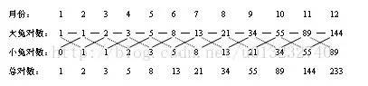

# 从生兔子问题看循环

兔子生崽问题，十分经典的题目，实现方式比较多，包括循环、递归等，下面请看题目：

> 假设一对小兔的成熟期是一个月，即一个月可长成成兔，那么如果每对成兔每个月都可以生一对小兔，一对新生的小兔从第二个月起就开始生兔子，试问从一对兔子开始繁殖，一年以后可有多少对大兔子？请编程求解该问题。



观察可得：

- 小兔对数 = 上个月的大兔对数
- 大兔对数 = 上个月的大兔对数 + 上个月的小兔对数

所以变换一下，每个月大兔对数 = 上月大兔对数 + 上上月大兔对数

有一个分段函数的表达方式如下所示：

> n∈N+,f(n) = {
>
> ​	1, n = 1
>
> ​	1, n = 2
>
> ​	f(n - 1) + f(n - 2), n > 3
>
> }

### 实现方法

第一步，可以用列表来保存每月大兔的数量

```python
arr = [1, 2]
```

第二步，根据题目知道需要获取12月内的每月大兔数量，定义一个变量 `day = 12`

```python
day = 12
```

第三步，从第`1` 个元素（索引为 `0`），循环获取到第 `12` 个元素（索引为 `11`），根据规则，初始化前俩月大兔数量都是1

```python
for i in range(1, day):
    if i == 1 or i == 2:
        arr.push(1)
    else:
        arr.push(arr[i - 2] + arr[i - 1])
```

最后打印数组即可

```python
print(arr)
```

具体代码请查阅 `code/rabbit-1.py`