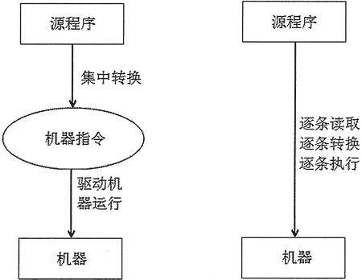

# 什么是解释型语言和编译型语言？

编译型语言：程序在执行之前需要先编译为可执行程序，运行过程中不需要翻译，执行效率高

解释型语言：逐行解释，解释完毕立即执行，执行效率低，跨平台方便



目前公司技术栈中，登录中心用的Java，是编译型语言，后端用的PHP、前端的JS都是解释型语言

Python 也是编译型语言中的一种，可以在 Windows、Linux、MacOS 中跨平台移植，扩展性强编写简单，但是速度慢

## 什么是IDE

Integrated Development Environment （集成开发环境），简单来说就是代码编写和运行的软件，Python作为一个解释型语言，其实只需要一个记事本能编码就可以了，执行时调用解析器解析一下即可。

比如，我用记事本写了如下一行代码，并保存在 `helloWorld.py`

```python
print('Hello World!')
```

然后在命令行执行如下指令

```shell
$ python3 helloWorld.py
Hello World!
```

现目前功能最全的IDE是 `PyCharm`，功能齐全，集成了版本控制、单元测试、运行、debug等，缺点就是比较占内存。

在 Linux 或者 MacOS 中可以考虑内置的 vim 编辑器，有着编辑器之神的称号，通过各种插件和配置可以实现一键运行、折叠代码、文件树、分屏等功能。可参考博客 [如何将VIM改造为Python的IDE](https://blog.wj2015.com/2019/11/06/%E5%A6%82%E4%BD%95%E5%B0%86vim%E6%94%B9%E9%80%A0%E4%B8%BApython%E7%9A%84ide/)