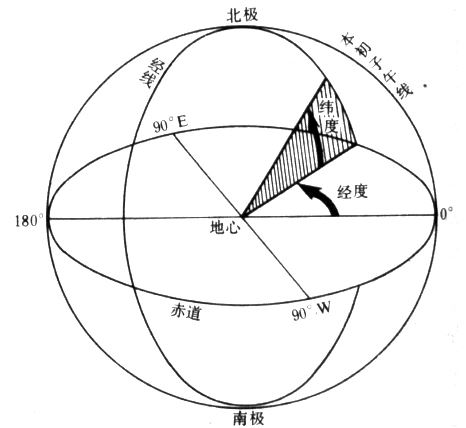
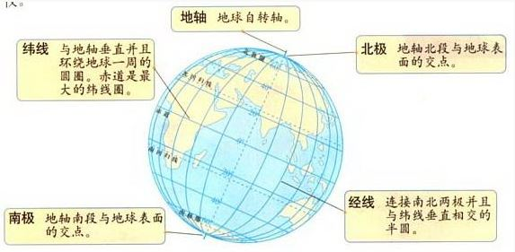
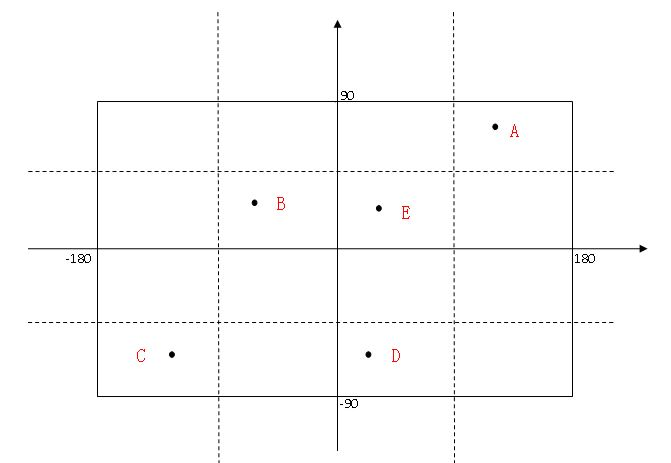
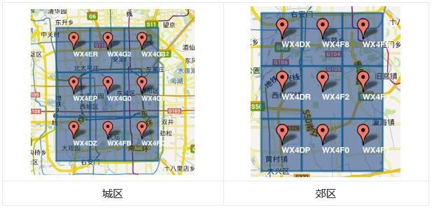

# Geo地理位置

Geo并不是一种新的数据类型，其实是一种对地理位置添加、查询做的一个封装；

实际存储使用的是 `zset` 有序集合结构，总所周知，Geo信息由 `经度` 和 `纬度`组成，如：`(39.9073455427,116.3912039995)`，而 `zset` 需要有一个 `score` 进行排序，而 Redis 中为了将经度纬度两个参数有序的排列起来，使用了 `GeoHash` 的方式将一个二维坐标转换为一维的，可排序的一串数字；从而实现了快速的范围查找以及定位精度信息的隐藏。

## 开始之前的地理小常识





首先，明确下 **经度**、**纬度**、**经线**、**纬线**的区别

#### 经线

经线是从**南极到北极**并与纬线垂直的线

#### 本初子午线

即经度为0的经线，规定是英国首都伦敦格林尼治天文台原址的那一条经线

#### 经度

经度是**经线与赤道交点和地心**的连线 与 **本初子午线赤道的交点和地心**连线，产生的夹角就是经度，可用来表示某一条经线

一个圆有360°，所以经度的范围是 [-180°, +180°]

#### 纬线

纬线是**平行于赤道**，环绕地球一周的线

#### 纬度

纬度是**平行于赤道**的与经线垂直的线，赤道定义为0°，北极90°，南极-90°，可用于表示某一条纬线

所以，经度的范围是 [-90°, +90°]

#### 经度纬度的差值与m的换算

经度或者纬度0.00001度，约等于1米，Gps一般精确到十米范围内

#### 经纬度表示地点

横轴看作经度，纵轴看作纬度，每一个点表示经线和纬线的交叉点



## GeoHash是什么？

GeoHash就是将经纬度的二维坐标以一串数字表示出来，转换出来字符串越长，范围越精确；并且生成的字符串有一个特点是，可以使用字符串前缀匹配来查找附近的Geo信息，前缀匹配越多距离越近。

通俗一点说，GeoHash就像是把上方由经纬度组成的坐标图分成一个一个正方形的小格子，从外往内给这些小格子编号，现在给到一个经纬度坐标值，对应到的小格子编号就是 GeoHash。

### 举个栗子

现在有三个地点的坐标

| 地点         | 坐标（经度,纬度）            | GeoHash     |
| ------------ | ---------------------------- | ----------- |
| 毛主席纪念碑 | 116.3915044069,39.9011604105 | wx4fbxc9ne0 |
| 天安门       | 116.3910812800,39.9076347400 | wx4g08cquf0 |
| 天津         | 117.2005570400,39.0886188700 | wwgq6gygdy0 |

GeoHash获取方式如下：

```shell
127.0.0.1:6379[12]> geoadd city 116.3915044069 39.9011604105 maozhuxi 116.3910812800 39.9076347400 tiananmen 117.2005570400 39.0886188700 tianjin
127.0.0.1:6379[12]> GEOHASH city maozhuxi tiananmen tianjin
1) "wx4fbxc9ne0"
2) "wx4g08cquf0"
3) "wwgq6gygdy0"
```

观察GeoHash可看出，`毛主席纪念碑`和`天安门` 算出来的Hash值比较相似，与 `天津` 没那么相似，所以 `毛主席纪念碑`离`天安门`比较近，离`天津`比较远，大多数情况下，字符串前缀匹配越多，两者越近。



## Redis提供的操作指令

| 指令              | 描述                                         | 定义                                                         |
| ----------------- | -------------------------------------------- | ------------------------------------------------------------ |
| GEOADD            | 添加一个地理位置信息                         | **GEOADD** key longitude latitude member [longitude latitude member ...] |
| GEODIST           | 给定两个位置之间的距离，支持指定单位         | **GEODIST** key member1 member2 [unit]                       |
| GEOPOS            | 获取指定元素的位置                           | **GEOPOS** key member [member ...]                           |
| GEOHASH           | 获取指定经纬度的GeoHash值                    | **GEOHASH** key member [member ...]                          |
| GEORADIUS         | 指定经纬度为中心，半径radius中的所有元素     | `GEORADIUS key longitude latitude radius m|km|ft|mi [WITHCOORD] [WITHDIST] [WITHHASH] [COUNT count]` |
| GEORADIUSBYMEMBER | 根据现有节点为中心，获取半径radius中所有元素 | `GEORADIUSBYMEMBER key member radius m|km|ft|mi [WITHCOORD] [WITHDIST] [WITHHASH] [COUNT count]` |

**[unit]** 表示单位，支持 m(米),km(千米),mi(英里),ft(英尺)

更详细介绍在此：[<https://www.cnblogs.com/php-no-2/p/9431464.html>](https://www.cnblogs.com/php-no-2/p/9431464.html)

注意：Geo相关操作并没有提供删除的方法，由于其数据存储结构是 `zset`，可以使用有序集合 `zrem`  等指令删除

## GeoHash具体算法

生成这个Hash可以分为如下步骤：

- 将经度以**在二分区间的左/右**划分多次，在左区间为0，否则为1，得到一串 0/1二进制，划分次数越多，经度越大
- 纬度同经度的处理方式
- 对得到的两串 0/1 字符串进行合并，偶数位放经度，奇数位放偶数，合并为一个新字符串
- 按照五位一组，转化为32进制（Base32），就得到了最终的GeoHash

反向解码这个Hash可以逆过来，同样可以分为如下步骤：

- 将GeoHash的每一个字符串视为32进制，转换为二进制
- 偶数位的二进制组合成经度的二进制，奇数位组合成纬度的二进制
- 以同样的划分逻辑，还原为原有经纬度

### 举个栗子

以 (116.3915044069,39.9011604105) 为例，二分区间会进行如下步骤：

解析纬度：39.9011604105

| 范围               | 左区间             | 右区间              | 标记 |
| ------------------ | ------------------ | ------------------- | ---- |
| [-90, 90]          | [-90, 0)           | [0, 90]             | 1    |
| [0, 90]            | [0, 45)            | [45, 90]            | 0    |
| [0, 45]            | [0, 22.5)          | [22.5, 45]          | 1    |
| [22.5, 45]         | [22.5, 33.75)      | [33.75, 45]         | 1    |
| [33.75, 45]        | [33.75, 39.375]    | [39.375, 45]        | 1    |
| [39.375, 45]       | [39.375, 42.1875‬]  | [42.1875‬, 45]       | 0    |
| [39.375, 42.1875‬]  | [39.375, 40.78125‬] | [40.78125‬, 42.1875] | 0    |
| [39.375, 40.78125‬] | [39.375, 40.78125‬] |                     |      |
|                    |                    |                     |      |
|                    |                    |                     |      |
|                    |                    |                     |      |

## 代码示例如下

```python
def encode(lng, lat):                                                 
    """传入经度和纬度，生成 geoHash"""                                          
    lngStr = splitByRange(lng, -180, 180)                             
    latStr = splitByRange(lat, -90, 90)                               
    return mergeLngLat(lngStr, latStr)                                
def splitByRange(originNumber, start, end, limit=11):                 
    """传入数字以及二分范围，返回二分区间编码二进制"""                                      
    pass                                                              
def mergeLngLat(lngStr, latStr):                                      
    """偶数位放经度，奇数位放纬度，合并新字符串，并转化为32进制"""                               
    pass                                                              
                                                                      
def decode(geohash):                                                  
    """传入geohash，返回经纬度"""                                             
    lngStr, latStr = splitGeoHash(geohash)                            
    lng = restoreByRange(lngStr, -180, 180)                           
    lat = restoreByRange(latStr, -90, 90)                             
    return lng, lat                                                   
def splitGeoHash(geohash):                                            
    """解码geohash，从32进制解码为二进制，奇数位拼接是经度，偶数位拼接是纬度"""                     
    pass                                                              
def restoreByRange(dstStr, start, end):                               
    """根据目标字符串和二分范围解码目标字符串"""                                         
    limit = len(dstStr)                                               
    pass                                                              
```

