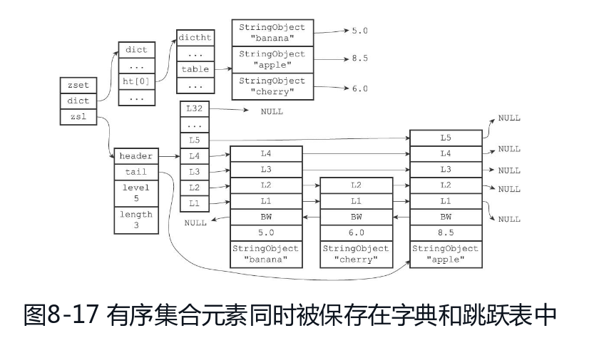

# 可排序集合

可排序集合也称为有序集合，简称 `zset` ，有序集合的每个元素都是唯一的，但是分值可以重复，而且可以按照分值排序。

可排序集合支持如下方法：

| 指令                 | 描述                                 | 定义                                                      |
| -------------------- | ------------------------------------ | --------------------------------------------------------- |
| **ZADD**             | 添加元素                             | zadd key score value [score value]                        |
| ZRANGEBYSCORE        | 获取区间内元素                       | zrangebyscore key startScore endScore [withscore][limit\] |
| **ZREVRANGEBYSCORE** | 获取分数区间内元素（倒序）           | zrevrangebyscore key endScore startScore [withscore]      |
| ZRANK                | 获取元素在集合中的索引（排名）       | zrank rank value                                          |
| **ZREVRANK**         | 获取集合中倒序的索引（倒序中排名）   | zrank key value                                           |
| ZREM                 | 删除元素                             | zrem key value                                            |
| **ZCARD**            | 获取集合中元素个数                   | zcard key                                                 |
| ZINCRBY              | 增减元素score                        | zincrby key 正负数                                        |
| ZCOUNT               | 获取分数区间内元素个数（配合做分页） | zcount key startScore endScore                            |
| ZSCORE               | 获取元素分数                         | zscore key value                                          |
| **ZRANGE**           | 获取索引区间元素（正序）             | zrange key startIndex endIndex [withscore]                |
| **ZREVRANGE**        | 获取索引区间范围内元素（倒序）       | zrevrange key startIndex endIndex [withscore]             |
| ZREMRANGEBYRANK      | 删除排名范围内的元素                 | zremrangebyrank key startIndex endIndex                   |
| ZREMRANGEBYSCORE     | 删除分数范围内的元素                 | zremrangbyscore key startScore endScore                   |
| ZINTERSTORE          | 求交集                               | zunionstore dstKey key1 key2 [weight1 weight2]            |

`zset` 为提高处理效率，底层使用 `ziplist` 或者 `skiplist`（dict+skiplist）

关于跳表的实现，可以参考 <https://blog.csdn.net/yanshuanche3765/article/details/82121043>

满足如下条件使用 `ziplist`，否则使用 `skiplist`

- 有序集合数量少于128个（可在 `zset-max-ziplist-entries` 修改）
- 有序集合保存元素均小于64字节（可在 `zset-max-ziplist-value` 修改）

可排序集合适合做排行榜等有排序的应用，根据底层数据不同，插入和获取范围效率也略有区别

当使用 `ziplist` 时，插入节点需要O(N)的时间复杂度，查询范围内需要O(logN)的时间复杂度

当使用 `skiplist` 时，使用字典查找分值的复杂度为O(1)，使用跳表查询分值范围O(logN)的复杂度

